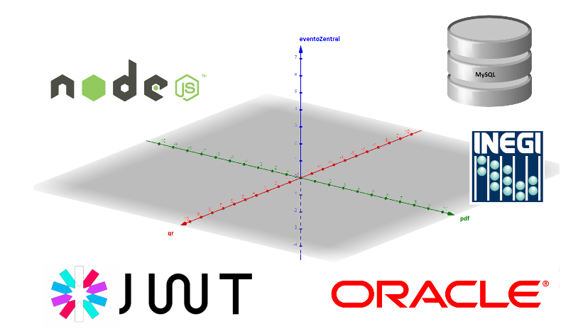

# InnovaDocs
InnovaDocs es un sistema de información diseñado para gestionar los datos relacionados con la feria de proyectos que el Instituto Tecnológico de Tijuana organiza anualmente. Está compuesto por una arquitectura de miroservicios que se comunican entre sí por medio de peticiones web utilizando un REST API.

El sistema está programado en nodejs y para persistencia utiliza una base de datos reacional en MySQL. Tiene métodos para manipular y consultar los datos y los expone con un servidor web de [express](https://expressjs.com/).

