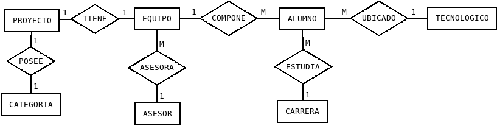
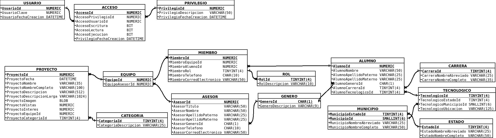
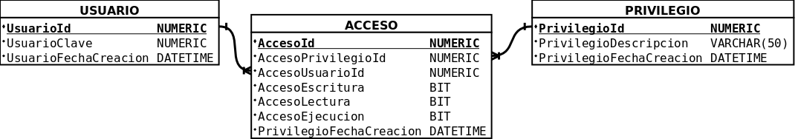
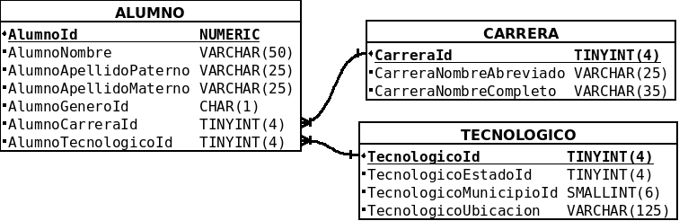
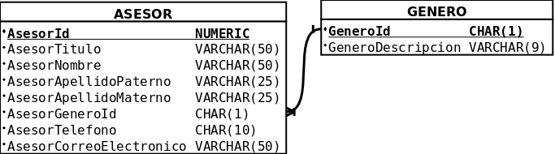
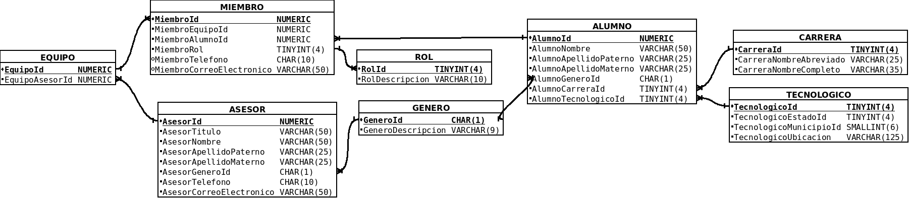
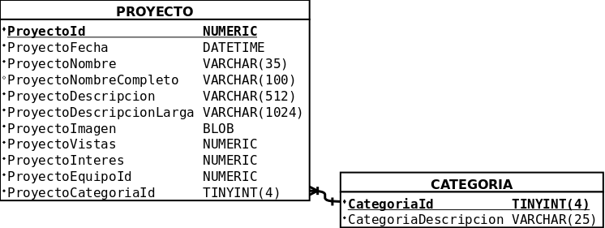
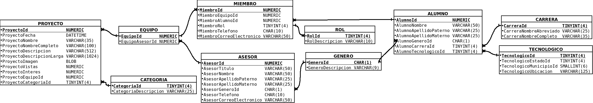
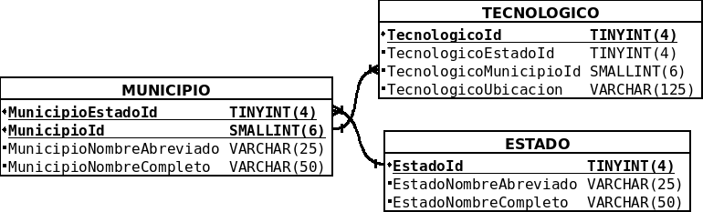

# Base de datos de InnovaDocs
Es una base de datos relacional de MySQL que alamacena información relevante a la feria de proyectos que organiza el Instituto Tecnológico de Tijuana anualmente. Está compuesta por 15 tablas que se relacionan entre sí y minimizan la redundancia de datos junto las posibles anomalías que pueden ocurrir.
```
+----------------------+
| Tables_in_InnovaDocs |
+----------------------+
| Acceso               |
| Alumno               |
| Asesor               |
| Carrera              |
| Categoria            |
| Equipo               |
| Estado               |
| Genero               |
| Miembro              |
| Municipio            |
| Privilegio           |
| Proyecto             |
| Rol                  |
| Tecnologico          |
| Usuario              |
+----------------------+
15 rows in set (0.00 sec)
```

## Diagrama de chen


## Diagrama entidad relación


## Diagrama entidad relación(OracleDDM)
.png)

### Vistas de la base de datos
#### Administrador

#### Alumno

#### Asesor

#### Equipo

#### Proyecto

#### Proyecto a detalle

#### Tecnológico


### Vistas de la base de datos(OracleDDM)
#### Administrador(OracleDDM)
.png)
#### Alumno(OracleDDM)
.png)
#### Asesor(OracleDDM)
.png)
#### Equipo(OracleDDM)
.png)
#### Proyecto(OracleDDM)
.png)
#### Proyecto a detalle(OracleDDM)
.png)
#### Tecnológico(OracleDDM)
.png)

## Tipos de datos utilizados de MySQL
Tipo de dato | Sinonimo | Bytes | Con signo | Sin signo
-------------|----------|-------|-----------|----------
TINYINT | byte | 1 | -128 a 127 | 0 a 255
SMALLINT | short | 2 | -32768 a 32767 | 0 a 65535
MEDIUMINT | ? | 3 | -8388608 a 8388607 | 0 a 16777215
INT | int | 4 | -2147483648 a 2147483647 | 0 a 4294967295
BIGINT | long | 8 | -2^63 a 2^63-1 | 0 a 2^64-1


## Diccionario de datos

## Privilegio
| Nombre |  Tipo de dato |  Uso | Vacío (?) | Default | Referencia |
|:------:|:-------------:|:----:|:---------:|:-------:|:----------:|
| PrivilegioId |  numeric (PK) | Identificador del privilegio |
| PrivilegioDescripcion |varchar| Describe el privilegio |sí|**'NULL'**||
| PrivilegioFechaCreacion | datetime | Muestra la fecha en la que se creo el privilegio |

## Acceso
| Nombre |  Tipo de dato |  Uso | Vacío (?) | Default | Referencia |
|:------:|:-------------:|:----:|:---------:|:-------:|:----------:|
|AccesoId|numeric (PK)|Idendificador del acceso|
|AccesoPrivilegioId|numeric (FK)|Llave foranea que conecta el acceso con el privilegio|||dbo.Privilegio (AccesoPrivilegioId -> PrivilegioId)|
|AccesoUsuarioId|numeric (FK)|Llave foranea que conecta el acceso con el usuario|||dbo.Usuario (AccesoUsuarioId -> UsuarioId)|
|AccesoLectura|bit|Lee el acceso|
|AccesoEscritura|bit|Escribe el acceso|
|AccesoEjecución|bit|Guarda la ejecución|
|AccesoFechaCreacion|datetime|Registra la fecha en la que se hizo un acceso|

## Usuario
| Nombre |  Tipo de dato |  Uso | Vacío (?) | Default | Referencia |
|:------:|:-------------:|:----:|:---------:|:-------:|:----------:|
|UsuarioId|numeric|Identificador del usuario|
|UsuarioClave|numeric|Clave del usuario|
|UsuarioFechaCreacion|datetime|Fecha en la que se crea un usuario|

## Proyecto
| Nombre |  Tipo de dato |  Uso | Vacío (?) | Default | Referencia |
|:------:|:-------------:|:----:|:---------:|:-------:|:----------:|
|ProyectoId|numeric|Identificador del proyecto|
|ProyectoFecha|date|Fecha de creacion del proyecto|sí|**'NULL'**|
|ProyectoNombre|varchar|Nombre del proyecto|sí|**'NULL'**|
|ProyectoNombreCompleto|varchar|Nombre completo del proyecto|sí|**'NULL'**|
|ProyectoDescripcion|varchar|Descripción del proyecto|sí|**'NULL'**|
|ProyectoDescripcionLarga|varchar|Nombre completo del proyecto|sí|**'NULL'**|
|ProyectoImagen|image|Imagen del proyecto|sí|**NULL**|
|ProyectoVistas|numeric|Numero de vistas totales del proyecto|sí|**NULL**|
|ProyectoInteres|numeric|Interes del proyecto|sí|**NULL**|
|ProyectoEquipoId|numeric (FK)|Llave foranea que conecta el proyecto con el equipo||**NULL**|dbo.Equipo (ProyectoEquipoId -> EquipoId)|
|ProyectoCategoriaId|smallint (FK)|Llave foranea que conecta el proyecto con el equipo||**NULL**|dbo.Categoria (ProyectoCategoriaId -> CategoriaId)|

## Categoría
| Nombre |  Tipo de dato |  Uso | Vacío (?) | Default | Referencia |
|:------:|:-------------:|:----:|:---------:|:-------:|:----------:|
|CategoriaId|numeric (PK)|Identificador de la categoría|
|CategoriaDescripcion|varchar|Descripción de la categoría|sí|**'NULL'**|

## Equipo
| Nombre |  Tipo de dato |  Uso | Vacío (?) | Default | Referencia |
|:------:|:-------------:|:----:|:---------:|:-------:|:----------:|
|EquipoId|numeric (PK)|Identificador del equipo|
|EquipoAsesorId|numeric (FK)|Llave foranea que conecta el equipo con el asesor|||dbo.Asesor (EquipoAsesorId -> AsesorId)|

## Asesor
| Nombre |  Tipo de dato |  Uso | Vacío (?) | Default | Referencia |
|:------:|:-------------:|:----:|:---------:|:-------:|:----------:|
|AsesorId|numeric (PK)|Identificador del asesor|
|AsesorTitulo|varchar|Titulo del asesor|sí|**'NULL'***|
|AsesorNombre|varchar|Nombre del asesor|sí|**'NULL'***|
|AsesorApellidoPaterno|varchar|Apellido paterno del asesor|sí|**'NULL'***|
|AsesorApellidoMaterno|varchar|Apellido Materno del asesor|sí|**'NULL'***|
|AsesorGeneroId|char (FK)|Titulo del asesor|||dbo.Genero (AsesorGeneroId -> GeneroId)|
|AsesorTelefono|char|Numero de telefono del asesor|sí|**'NULL'***|
|AsesorCorreoElectronico|varchar|Correo electronico del asesor|sí|**'NULL'***|

## Miembro
| Nombre |  Tipo de dato |  Uso | Vacío (?) | Default | Referencia |
|:------:|:-------------:|:----:|:---------:|:-------:|:----------:|
|MiembroId|numeric (PK)|Identificador del miembro|
|MiembroEquipoId|numeric (FK)|Llave foranea que conecta el miembro con el equipo|||dbo.Equipo (MiembroEquipoId -> EquipoId)|
|MiembroAlumnoId|int (FK)|Llave foranea que conecta el miembro con el alumno|||dbo.Alumno (MiembroAlumnoId -> AlumnoId)|
|MiembroRolId|tinyint (FK)|Llave foranea que conecta el miembro con el rol|||dbo.Rol (MiembroRolId -> RolId)|
|MiembroTelefono|char|Numero de telefono del miembro|sí|**'NULL'**|
|MiembroCorreoElectronico|varchar|Correo electronico del miembro|sí|**'NULL'**|

## Rol
| Nombre |  Tipo de dato |  Uso | Vacío (?) | Default | Referencia |
|:------:|:-------------:|:----:|:---------:|:-------:|:----------:|
|RolId|tinyint (PK)|Identificador del rol|
|RolDescripcion|varchar|Descripcion del rol|sí|**'NULL'**|

## Alumno
| Nombre |  Tipo de dato |  Uso | Vacío (?) | Default | Referencia |
|:------:|:-------------:|:----:|:---------:|:-------:|:----------:|
|AlumnoId|int (PK)|Identificador del alumno|
|AlumnoNombre|varchar|Nombre del alumno|sí|**'NULL'**|
|AlumnoApellidoPaterno|varchar|Apellido paterno del alumno|sí|**'NULL'**|
|AlumnoApellidoMaterno|varchar|Apellido materno del alumno|sí|**'NULL'**|
|AlumnoGeneroId|char (FK)|Llave foranea que conecta el alumno con el genero|||dbo.Genero (AlumnoGeneroId -> GeneroId)|
|AlumnoCarreraId|tinyint (FK)|Llave foranea que conecta el alumno con la carrera||**NULL**|dbo.Carrera (AlumnoCarreraId -> CarreraId)|
|AlumnoTecnologicoId|tinyint (FK)|Llave foranea que conecta el alumno con el tecnologico||**NULL**|dbo.Tecnologico (AlumnoTecnologicoId -> TecnologicoId)|

## Genero
| Nombre |  Tipo de dato |  Uso | Vacío (?) | Default | Referencia |
|:------:|:-------------:|:----:|:---------:|:-------:|:----------:|
|GeneroId|char (PK)|Identificador de genero|
|GeneroDescripcion|varchar|Descripcion del genero|

## Carrera
| Nombre |  Tipo de dato |  Uso | Vacío (?) | Default | Referencia |
|:------:|:-------------:|:----:|:---------:|:-------:|:----------:|
|CarreraId|tinyint (PK)|Identificador de la carrera|
|CarreraNombreAbreviado|varchar|Nombre abreviado de la carrera|sí|**'NULL'**|
|CarreraNombreCompleto|varchar|Nombre completo de la carrera|sí|**'NULL'**|

## Tecnologico
| Nombre |  Tipo de dato |  Uso | Vacío (?) | Default | Referencia |
|:------:|:-------------:|:----:|:---------:|:-------:|:----------:|
|TecnologicoId|tinyint (PK)|Identificador de tecnologico|
|TecnologicoEstadoId|tinyint (FK)|Llave foranea que conecta tecnologico con estado|
|TecnologicoMunicipioId|smallint|Llave foranea que conecta tecnologico con municipio|||dbo.Municipio (TecnologicoEstadoId, TecnologicoMunicipioId -> MunicipioEstadoId, MunicipioId)|
|TecnologicoUbicacion|varchar|Ubicacion de tecnologico|sí|**'NULL'**|

## Municipio
| Nombre |  Tipo de dato |  Uso | Vacío (?) | Default | Referencia |
|:------:|:-------------:|:----:|:---------:|:-------:|:----------:|
|MunicipioId|smallint (PK)|Identificador del municipio|
|MunicipioNombreAbreviado|varchar|Nombre abreviado del municipio|sí|**'NULL'**|
|MunicipioNombreCompleto|varchar|Nombre completo del municipio|sí|**'NULL'**|
|MunicipioEstadoId|tinyint (PK,FK)|Llave primaria/foranea que conecta el municipio con el estado|

## Estado
| Nombre |  Tipo de dato |  Uso | Vacío (?) | Default | Referencia |
|:------:|:-------------:|:----:|:---------:|:-------:|:----------:|
|EstadoId|tinyint (PK)|Identificador del estado|
|EstadoNombreAbreviado|varchar|Nombre abreviado del estado|sí|**'Null'**|
|EstadoNombreCompleto|varchar|Nombre completo del estado|sí|**'Null'**|
